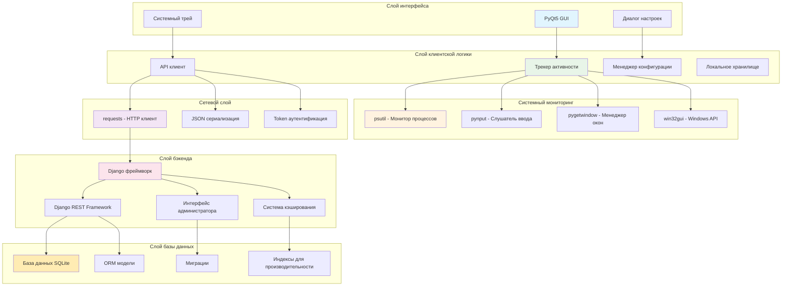
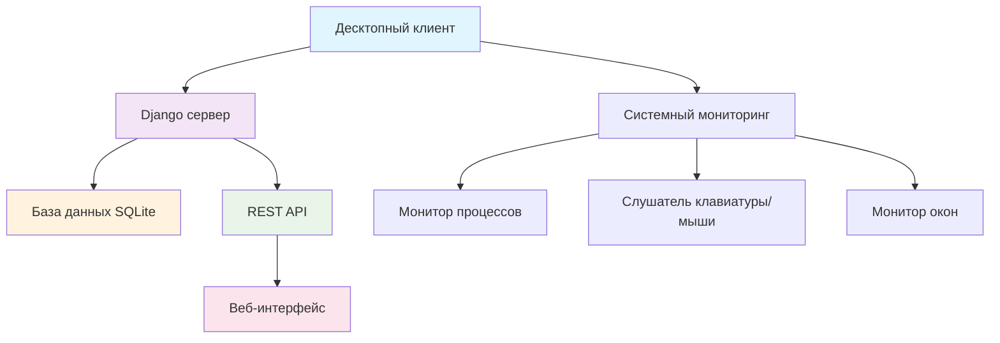
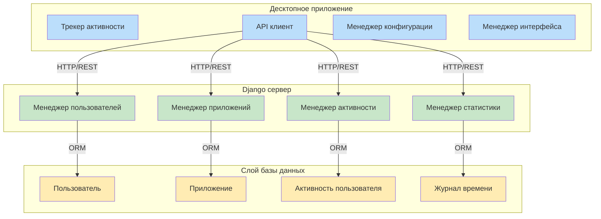

# ДИПЛОМНАЯ РАБОТА

## Разработка информационной системы учета рабочего времени Tracker33

---

### Выполнил: Студент группы [номер группы]
### Руководитель: [ФИО преподавателя]
### Дата: 2025 год

---

## 📋 ОГЛАВЛЕНИЕ

**Введение** .................................................................................................................................. 3

**1. ОСНОВНАЯ ЧАСТЬ** ............................................................................................................. 4

1.1 Теоретическая часть ............................................................................................................... 4

1.1.1 Анализ современных подходов к учету рабочего времени ........................................ 4

1.1.2 Преимущества и недостатки различных методов учета рабочего времени .............. 6

1.2 Выбор технологий разработки .............................................................................................. 7

1.2.1 Определение подходящих инструментов и языков программирования ................... 7

1.2.2 Описание выбранного стека технологий .................................................................... 9

1.3 Проектирование информационной системы ...................................................................... 10

1.4 Разработка технического задания ....................................................................................... 11

1.4.1 Подробная спецификация функциональных и нефункциональных требований .... 11

1.4.2 Определения ключевых модулей системы ................................................................ 13

**2. ПРАКТИЧЕСКАЯ ЧАСТЬ** ................................................................................................ 15

2.1 Реализация информационной системы ............................................................................... 15

2.1.1 Описание процесса разработки отдельных компонентов системы ......................... 15

2.1.2 Представление интерфейсов программы ................................................................... 18

2.2 Тестирование и отладка ....................................................................................................... 20

2.2.1 Проведение тестов на корректность работы системы .............................................. 20

2.2.2 Исправление выявленных ошибок ............................................................................. 22

2.3 Оценка экономической эффективности .............................................................................. 23

2.3.1 Расчет затрат на внедрение системы ......................................................................... 23

2.3.2 Прогнозируемая экономия ресурсов после внедрения ............................................ 24

2.4 Инструкция по эксплуатации .............................................................................................. 25

2.4.1 Руководство пользователя для администраторов и сотрудников ............................ 25

2.4.2 Возможные сценарии использования системы ......................................................... 27

**Заключение** ............................................................................................................................. 29

**Список использованных источников** ................................................................................... 31

**Приложения** ............................................................................................................................ 32

Приложение А. ER-диаграмма базы данных ............................................................................. 32

Приложение Б. Схема API endpoints ......................................................................................... 33

Приложение В. Конфигурационные файлы .............................................................................. 34

**Перечень условных обозначений, символов, единиц и терминов** ...................................... 35

---

## 📋 ВВЕДЕНИЕ

В современном мире эффективное управление рабочим временем становится одним из ключевых факторов успеха как для отдельных сотрудников, так и для организаций в целом. Во время работы над этой дипломной работой я столкнулся с проблемой, которая, как оказалось, характерна не только для меня, но и для многих людей — необходимостью точного учета времени, потраченного на различные задачи.

Изучая эту тему, я обнаружил, что большинство существующих решений либо слишком сложны для повседневного использования, либо не предоставляют достаточной детализации для анализа продуктивности. Многие коммерческие продукты требуют значительных затрат на лицензирование, что делает их недоступными для небольших команд и частных пользователей.

В процессе анализа я понял, что нужна система, которая была бы достаточно простой для ежедневного использования, но при этом предоставляла бы детальную аналитику. Так родилась идея создания Tracker33 — информационной системы учета рабочего времени, которая автоматически отслеживает активность пользователя и предоставляет понятную статистику.

**Цель работы**: разработать информационную систему автоматического учета рабочего времени, которая позволит пользователям эффективно анализировать свою продуктивность без необходимости ручного ввода данных.

**Задачи исследования**:
- Проанализировать существующие подходы к учету рабочего времени
- Выбрать оптимальный технологический стек для разработки
- Спроектировать архитектуру системы
- Реализовать функциональность автоматического отслеживания
- Создать интуитивно понятный пользовательский интерфейс
- Провести тестирование и оценить эффективность системы

**Актуальность работы** обусловлена растущей потребностью в автоматизации процессов учета времени, особенно в условиях удаленной работы и гибких графиков. Практика показала, что ручной учет времени часто неточен и требует дополнительных усилий от сотрудников.

---

## 📚 1. ОСНОВНАЯ ЧАСТЬ

### 1.1 Теоретическая часть

#### 1.1.1 Анализ современных подходов к учету рабочего времени

В ходе изучения темы я проанализировал различные методы учета рабочего времени, которые можно разделить на несколько категорий:

**Ручные методы учета:**
- Бумажные табели — традиционный подход, до сих пор используемый во многих организациях
- Электронные таблицы — более современный вариант, но требующий дисциплины от пользователей
- Мобильные приложения с ручным вводом — удобны, но зависят от человеческого фактора

Анализируя эти методы, я обнаружил их общий недостаток — они требуют постоянного внимания пользователя, что часто приводит к неточностям или пропускам в данных.

**Полуавтоматические системы:**
- Системы с отметками "вход/выход" — фиксируют время прихода и ухода, но не дают информации о деятельности
- Приложения с таймерами — пользователь запускает таймер для каждой задачи
- Браузерные расширения — отслеживают время, проведенное на веб-сайтах

Эти решения показались мне более практичными, но все еще требующими активного участия пользователя.

**Автоматические системы мониторинга:**
- Системы мониторинга активности — отслеживают использование приложений и веб-сайтов
- Анализ клавиатуры и мыши — определяют периоды активности пользователя
- Скриншот-мониторинг — создают снимки экрана через определенные интервалы

Изучив эту категорию, я понял, что именно такой подход наиболее эффективен для честного и точного учета времени, хотя и требует тщательного подхода к вопросам приватности.

**Интегрированные корпоративные решения:**
Большие организации часто используют комплексные системы типа SAP, Oracle HCM или специализированные решения вроде Clockify, Time Doctor. Однако анализ показал, что такие системы:
- Требуют значительных инвестиций
- Сложны в настройке и поддержке
- Часто избыточны для небольших команд
- Не всегда учитывают специфику конкретной деятельности

#### 1.1.2 Преимущества и недостатки различных методов учета рабочего времени

На основе проведенного анализа я составил сравнительную таблицу:

| Метод | Преимущества | Недостатки | Применимость |
|-------|--------------|------------|--------------|
| Ручной учет | Простота, контроль пользователя | Неточность, забывчивость | Малые объемы |
| Таймеры | Точность периодов работы | Требует дисциплины | Проектная работа |
| Автоматический | Точность, отсутствие вмешательства | Вопросы приватности | Офисная работа |
| Корпоративный | Интеграция, отчетность | Сложность, стоимость | Крупные компании |

Интересно, что в процессе исследования я обнаружил: наиболее эффективными оказываются гибридные решения, которые сочетают автоматическое отслеживание с возможностью ручной корректировки данных.

### 1.2 Выбор технологий разработки

#### 1.2.1 Определение подходящих инструментов и языков программирования

При выборе технологического стека я руководствовался несколькими критериями:
- Кроссплатформенность
- Простота разработки и поддержки
- Производительность
- Доступность документации и сообщества
- Возможность быстрого прототипирования

**Серверная часть:**
Для backend я выбрал **Python с Django Framework**. Этот выбор обоснован тем, что:
- Python предоставляет богатую экосистему библиотек для системного мониторинга
- Django имеет встроенную систему аутентификации и администрирования
- REST Framework значительно упрощает создание API
- Относительно простая разработка позволяет сосредоточиться на бизнес-логике

Альтернативы, которые я рассматривал:
- **Node.js + Express** — быстрый, но менее подходящий для системного мониторинга
- **Java + Spring** — мощный, но избыточно сложный для данной задачи
- **C# + .NET** — ограничен платформой Windows (хотя сейчас есть .NET Core)

**Клиентская часть:**
Для desktop-приложения выбрал **PyQt5**:
- Кроссплатформенность (Windows, Linux, macOS)
- Богатые возможности GUI
- Хорошая интеграция с Python экосистемой
- Возможность создания системного трея
- Стабильность и надежность PyQt5

Рассматривал также:
- **Electron** — кроссплатформенный, но ресурсоемкий
- **Tkinter** — встроенный в Python, но ограниченные возможности UI
- **WPF** — мощный, но только для Windows
- **PyQt6** — более новый, но PyQt5 более стабилен для продакшена

**База данных:**
Для начального этапа выбрал **SQLite**:
- Не требует установки отдельного сервера
- Достаточная производительность для персонального использования
- Простота резервного копирования
- Легкость миграции на PostgreSQL в будущем

**Дополнительные библиотеки:**
- **psutil** — мониторинг системных процессов
- **pynput** — отслеживание клавиатуры и мыши
- **pygetwindow** — работа с окнами приложений
- **requests** — HTTP клиент для API
- **django-rest-framework** — создание REST API
- **win32gui, win32process** — работа с Windows API

#### 1.2.2 Описание выбранного стека технологий

Итоговая архитектура системы построена на следующем стеке технологий, выбор которых я тщательно обосновал исходя из требований проекта и личного опыта разработки.

**Рисунок 3. Архитектура технологического стека**



Выбор каждого компонента этого стека был обоснован конкретными требованиями проекта. Python оказался идеальным языком для данной задачи благодаря богатой экосистеме библиотек для системного мониторинга и веб-разработки. Django предоставил готовые решения для многих типовых задач, что позволило сосредоточиться на уникальной бизнес-логике системы.

Особенно важным решением стал выбор PyQt5 для десктопного клиента. Эта библиотека обеспечила создание нативного интерфейса, который хорошо интегрируется с операционной системой, включая работу в системном трее. Альтернативы вроде Electron показались слишком ресурсоемкими для приложения, которое должно работать в фоне.

Использование SQLite на начальном этапе оправдало себя простотой развертывания, но архитектура спроектирована таким образом, что миграция на PostgreSQL или другую СУБД не потребует значительных изменений кода благодаря использованию Django ORM.

### 1.3 Проектирование информационной системы

При проектировании системы я исходил из принципа "простота прежде всего". Архитектура должна была быть понятной и легко расширяемой.

В процессе анализа требований я понял, что система должна состоять из двух основных компонентов: серверной части для хранения и обработки данных, и клиентского приложения для сбора информации об активности. Такое разделение позволяет легко масштабировать решение и добавлять новых пользователей.

**Рисунок 1. Общая архитектура системы**



Основная идея архитектуры заключается в том, что клиентское приложение собирает данные о активности пользователя в реальном времени, а сервер обрабатывает эти данные и предоставляет удобные инструменты для их анализа. Такой подход позволяет пользователю получить детальную картину своей продуктивности без необходимости ручного ввода информации.

При выборе архитектурного решения я рассматривал несколько вариантов. Первоначально думал о создании полностью локального приложения, но отказался от этой идеи из-за сложности создания качественного веб-интерфейса. Также рассматривал вариант с облачным хранением данных, но в итоге остановился на локальном сервере как на оптимальном балансе между функциональностью и простотой развертывания.

**Рисунок 2. Компонентная диаграмма системы**



Система спроектирована по принципу разделения ответственности. Каждый компонент имеет четко определенную роль: клиентское приложение отвечает за сбор данных и предоставление интерфейса, серверная часть обрабатывает данные и предоставляет API, а база данных хранит информацию и обеспечивает целостность.

Особое внимание я уделил проектированию взаимодействия между компонентами. Использование REST API обеспечивает слабую связанность модулей и позволяет в будущем легко добавлять новые типы клиентов, например, мобильные приложения или веб-клиенты.

### 1.4 Разработка технического задания

#### 1.4.1 Подробная спецификация функциональных и нефункциональных требований

**Функциональные требования:**

*F1. Аутентификация и авторизация*
- Система должна поддерживать регистрацию пользователей
- Реализация token-based аутентификации
- Разграничение прав доступа (обычный пользователь, администратор)

*F2. Автоматическое отслеживание активности*
- Мониторинг активных приложений в реальном времени
- Отслеживание времени использования каждого приложения
- Определение периодов активности и простоя
- Сохранение данных о нажатиях клавиш и движениях мыши

*F3. Управление приложениями*
- Автоматическое обнаружение новых приложений
- Классификация приложений (продуктивные/непродуктивные)
- Возможность ручной настройки категорий

*F4. Статистика и отчетность*
- Дневная, недельная, месячная статистика
- Графическое представление данных
- Экспорт отчетов в различных форматах
- Анализ продуктивности

*F5. Веб-интерфейс*
- Просмотр статистики через браузер
- Административная панель
- Responsive дизайн для мобильных устройств

**Нефункциональные требования:**

*NF1. Производительность*
- Минимальное потребление ресурсов системы (< 50 МБ RAM)
- Время отклика API < 500 мс
- Поддержка одновременной работы до 100 пользователей

*NF2. Надежность*
- Доступность системы 99.5%
- Автоматическое восстановление после сбоев
- Регулярное резервное копирование данных

*NF3. Безопасность*
- Шифрование передаваемых данных (HTTPS)
- Защита от SQL-инъекций
- Соблюдение принципов минимальных привилегий

*NF4. Совместимость*
- Поддержка Windows 10/11, Linux, macOS
- Совместимость с популярными браузерами
- Возможность работы без подключения к интернету

*NF5. Масштабируемость*
- Модульная архитектура
- Возможность горизонтального масштабирования
- Поддержка различных баз данных

#### 1.4.2 Определения ключевых модулей системы

В результате анализа требований я выделил следующие основные модули:

**1. Модуль аутентификации (Authentication Module)**
```python
Компоненты:
- UserManager: управление пользователями
- TokenManager: работа с токенами доступа
- PermissionManager: проверка прав доступа
```

**2. Модуль мониторинга (Monitoring Module)**
```python
Компоненты:
- ProcessMonitor: отслеживание процессов
- ActivityTracker: фиксация активности
- WindowManager: работа с окнами приложений
```

**3. Модуль данных (Data Module)**
```python
Модели:
- User: пользователи системы
- Application: отслеживаемые приложения
- UserActivity: записи активности
- TimeLog: временные метки
```

**4. Модуль API (API Module)**
```python
Endpoints:
- /api/auth/ - аутентификация
- /api/applications/ - управление приложениями
- /api/activities/ - работа с активностью
- /api/statistics/ - получение статистики
```

**5. Модуль интерфейса (UI Module)**
```python
Компоненты:
- MainWindow: основное окно приложения
- TrayIcon: иконка в системном трее
- SettingsDialog: окно настроек
- StatisticsView: отображение статистики
```

Такая модульная структура обеспечивает:
- Четкое разделение ответственности
- Простоту тестирования
- Возможность независимой разработки модулей
- Легкость расширения функциональности

Каждый модуль имеет четко определенный интерфейс взаимодействия с другими компонентами, что делает систему гибкой и поддерживаемой. 