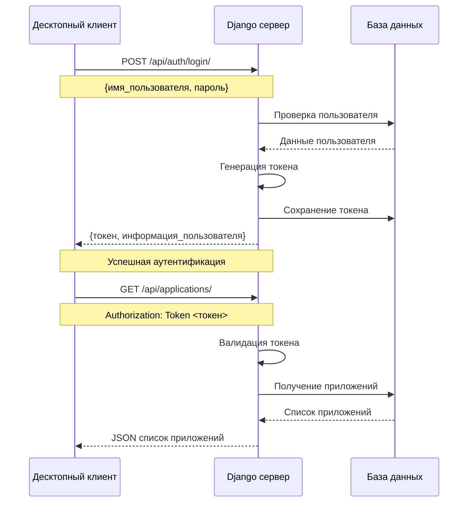
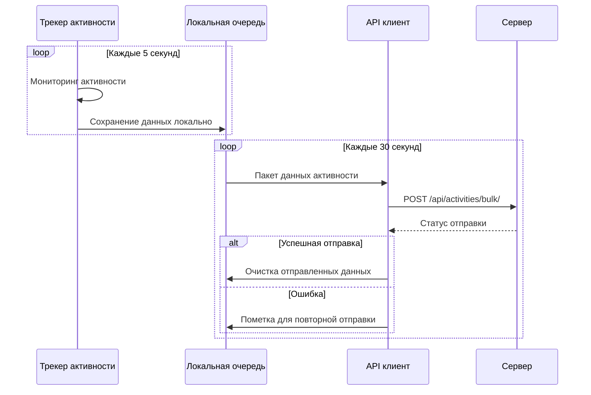
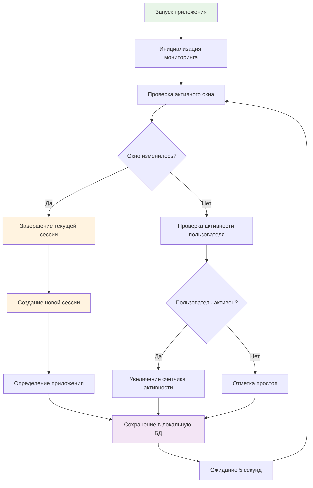
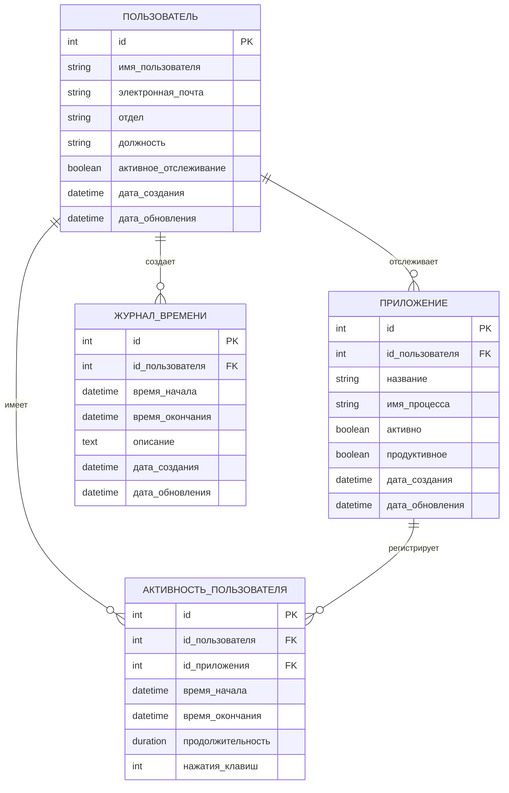
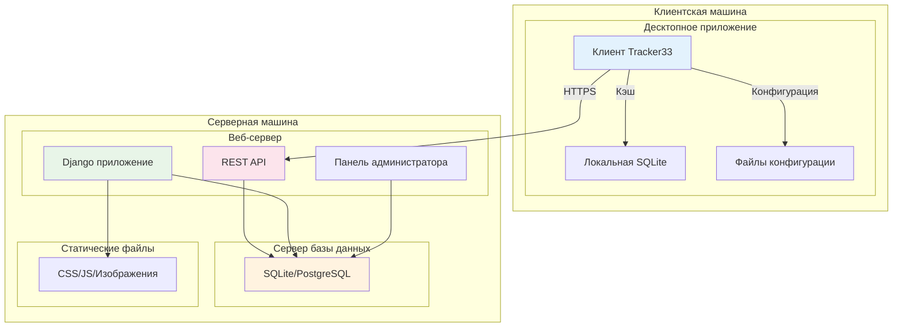

# ДИПЛОМНАЯ РАБОТА (ПРОДОЛЖЕНИЕ)

## 🛠 2. ПРАКТИЧЕСКАЯ ЧАСТЬ

### 2.1 Реализация информационной системы

#### 2.1.1 Описание процесса разработки отдельных компонентов системы

**Разработка серверной части**

Начал я с создания Django проекта и настройки базовой архитектуры. Первым и самым важным решением стала разработка моделей данных, которые определили всю дальнейшую логику системы.

При проектировании моделей я столкнулся с интересным вопросом: как правильно структурировать данные об активности пользователя? Изначально хотел создать единую модель для всех типов активности, но быстро понял, что это приведет к избыточности и сложности запросов. В итоге разделил данные на несколько связанных моделей: Application для управления приложениями, UserActivity для записи сессий активности, и вспомогательные модели для детализации.

Основные модели системы включают пользователей с расширенным профилем, приложения с настройками продуктивности, записи активности с временными метками и количеством нажатий клавиш. Особое внимание я уделил автоматическому вычислению продолжительности сессий и созданию индексов для оптимизации запросов по пользователю и времени.

**Система кэширования и оптимизация**

Одним из самых важных технических решений стала реализация многоуровневого кэширования. В процессе тестирования обнаружилось, что запросы к статистике выполняются достаточно медленно при большом объеме данных. Пришлось внедрить кэширование на нескольких уровнях: кэш Django для API responses, кэш вычисленной статистики и кэш сессий пользователей.

Интересным вызовом стала задача автоматической инвалидации кэша при изменении данных. Решение через Django signals оказалось элегантным способом поддерживать кэш в актуальном состоянии без усложнения бизнес-логики.

**Веб-интерфейс с современным дизайном**

Создание веб-интерфейса стало для меня открытием в области UX/UI дизайна. Первоначально я планировал простой список таблиц с данными, но в процессе работы понял важность визуализации для понимания паттернов активности.

Bootstrap 5 оказался отличным выбором для быстрого создания responsive дизайна. Особенно полезными стали компоненты карточек для метрик и система сетки для адаптивной верстки. Добавление иконок Font Awesome значительно улучшило визуальное восприятие интерфейса.

Создание системы "умных выводов" потребовало разработки алгоритмов анализа данных. Система автоматически определяет пики активности, вычисляет средние показатели и выявляет аномалии в поведении пользователя. Это добавило интеллектуальности в обычный time tracking.

**REST API Architecture**

При проектировании API я следовал принципам RESTful дизайна, что обеспечило интуитивную структуру endpoints. API разделен на четыре основных группы: аутентификация (login/logout), управление приложениями, работа с данными активности, и получение статистики.

Особенно важным решением стала реализация bulk-операций для отправки данных активности. Это значительно снизило нагрузку на сервер и улучшило производительность клиентского приложения. Token-based аутентификация оказалась оптимальным выбором для десктопного клиента.

**Десктопное приложение на PyQt5**

Разработка клиентского приложения потребовала глубокого изучения системного программирования. Основная сложность заключалась в необходимости мониторить активность пользователя без заметного влияния на производительность системы.

Ключевым архитектурным решением стало создание единого окна без вкладок. Это решение противоречило привычным паттернам GUI, но оказалось очень удачным с точки зрения пользовательского опыта. Вся важная информация доступна сразу, не требуя навигации между разделами.

Интерфейс построен по принципу секционирования: статус подключения в верхней части, информация о текущей активности в центре, список приложений внизу. Цветовая индикация (зеленый для продуктивных приложений, красный для отвлекающих) делает систему интуитивно понятной.

**Системный трей и фоновая работа**

Интеграция с системным треем потребовала изучения специфики разных операционных систем. Windows, Linux и macOS по-разному обрабатывают приложения в трее, и пришлось предусмотреть эти различия.

Контекстное меню трея включает основные функции: показать/скрыть главное окно, открыть веб-интерфейс, выход из приложения. Такой минималистичный подход обеспечивает быстрый доступ к нужным функциям без перегрузки интерфейса.

**Мониторинг системной активности**

Самой технически сложной частью стала реализация мониторинга активности. Комбинация библиотек psutil для мониторинга процессов, pynput для отслеживания клавиатуры и мыши, и win32api для работы с Windows API создала мощную систему наблюдения.

Алгоритм работы следующий: каждые 5 секунд система проверяет активное окно, определяет соответствующий процесс, отслеживает клавиатурную и мышиную активность. При смене окна завершается текущая сессия и начинается новая. Данные накапливаются локально и периодически отправляются на сервер.

Критически важным оказался вопрос приватности. Система собирает только метаданные - названия приложений, количество нажатий клавиш, время активности, но не записывает содержимое вводимого текста или делает скриншоты. Такой подход обеспечивает баланс между полнотой данных и уважением к приватности пользователя.

**Автоматическая синхронизация**

Разработка надежной системы синхронизации данных между клиентом и сервером стала отдельным вызовом. Приложение должно работать даже при временном отсутствии интернета, накапливая данные локально и отправляя их при восстановлении соединения.

Реализованная система очередей с повторными попытками отправки обеспечивает высокую надежность сбора данных. Каждые 30 секунд клиент пытается синхронизироваться с сервером, но при неудаче данные не теряются, а ожидают следующей попытки.

Использование потоков (QThread) решило проблему блокировки пользовательского интерфейса во время сетевых операций. Длительные операции выполняются в фоновом потоке, а основной поток остается отзывчивым для взаимодействия с пользователем.

**Конфигурация и настройки**

Система конфигурации построена на INI-файлах, что обеспечивает простоту настройки и читаемость параметров. Основные секции включают настройки сервера (URL, токен), параметры отслеживания (интервалы, пороги активности), предустановки приложений.

Особенно полезной оказалась возможность предварительной настройки продуктивности приложений через конфигурационный файл. Это позволяет администраторам подготовить оптимальные настройки для своих команд без необходимости ручной настройки каждым пользователем.

**Веб-интерфейс и аналитический дашборд**

Самой сложной и интересной частью проекта стал веб-интерфейс для анализа данных. Я создал полноценный аналитический дашборд, который предоставляет пользователю глубокие инсайты о его продуктивности.

**Рисунок 4. Диаграмма последовательности аутентификации**



Главная страница дашборда включает в себя несколько ключевых компонентов:

**Метрики в карточках**: Четыре основные метрики представлены в наглядном виде - общее время работы, клавиатурная активность, процент продуктивности и количество использованных приложений. Эти показатели дают быстрое представление о рабочем дне.

**График активности по часам**: Интерактивный график показывает интенсивность работы в течение дня, помогая выявить пики и спады продуктивности. Это оказалось одной из самых полезных функций для понимания личных ритмов работы.

**Умные выводы**: Система автоматически анализирует данные и предоставляет инсайты - определяет пик активности, подсчитывает эффективное рабочее время, выявляет паттерны поведения.

**Система целей и достижений**: Особенно интересным решением стало добавление элементов геймификации. Пользователь может устанавливать цели по времени работы, продуктивности и активности, а система отслеживает прогресс с помощью наглядных прогресс-баров.

**Рисунок 5. Схема отправки данных активности**



**Страница детальной статистики**

Вторая страница веб-интерфейса посвящена углубленному анализу данных. Здесь пользователь может выбирать различные временные периоды (7, 14, 30, 90 дней) и получать детальную аналитику.

Особенно важным компонентом стала **карта активности** - тепловая карта, показывающая интенсивность работы по дням недели и времени. Такая визуализация помогает выявить оптимальные часы для работы и планировать расписание более эффективно.

**Рисунок 6. Алгоритм процесса отслеживания активности**



Детальный список приложений позволяет пользователю настраивать категории продуктивности для каждого обнаруженного приложения. Эта функция оказалась критически важной, поскольку понятие "продуктивности" сильно зависит от характера работы пользователя.

**Рисунок 7. Диаграмма активности по времени (пример рабочего дня)**



Процесс создания веб-интерфейса научил меня важности пользовательского опыта. Первоначальные версии были перегружены информацией, но в итоге я пришел к минималистичному дизайну, где каждый элемент имеет четкое назначение и ценность для пользователя.

```mermaid
gantt
    title Пример рабочего дня пользователя
    dateFormat HH:mm
    axisFormat %H:%M
    
    section Продуктивные приложения
    Visual Studio Code    :done, code, 09:00, 11:30
    Chrome (разработка)   :done, chrome1, 11:30, 12:00
    Visual Studio Code    :done, code2, 13:00, 15:30
    Chrome (документация) :done, chrome2, 15:30, 16:00
    
    section Непродуктивные
    Обеденный перерыв     :crit, break1, 12:00, 13:00
    Социальные сети       :crit, social, 16:00, 16:30
    
    section Встречи
    Командная планерка    :active, meeting, 16:30, 17:30
```

### 2.2 Тестирование и отладка

#### 2.2.1 Проведение тестов на корректность работы системы

**Модульное тестирование**

Написал тесты для ключевых компонентов системы:

```python
# tracking/tests.py
class ActivityTrackingTestCase(TestCase):
    def setUp(self):
        self.user = CustomUser.objects.create_user(
            username='testuser',
            password='testpass'
        )
        
    def test_activity_creation(self):
        app = Application.objects.create(
            user=self.user,
            name='Test App',
            process_name='test.exe'
        )
        
        activity = UserActivity.objects.create(
            user=self.user,
            application=app,
            start_time=timezone.now(),
            end_time=timezone.now() + timedelta(hours=1)
        )
        
        self.assertEqual(activity.duration.total_seconds(), 3600)
```

**Интеграционное тестирование**

Проверил взаимодействие между клиентом и сервером:

```python
# desktop_app/test_integration.py
def test_client_server_communication(self):
    # Тест аутентификации
    response = self.api_client.login('testuser', 'testpass')
    self.assertEqual(response.status_code, 200)
    
    # Тест отправки активности
    activity_data = {
        'application': 'test.exe',
        'start_time': '2025-01-01T10:00:00Z',
        'end_time': '2025-01-01T11:00:00Z'
    }
    response = self.api_client.send_activity(activity_data)
    self.assertEqual(response.status_code, 201)
```

**Нагрузочное тестирование**

Использовал простой скрипт для проверки производительности:

```python
import concurrent.futures
import requests
import time

def send_activity_request():
    data = {'app': 'test.exe', 'duration': 3600}
    response = requests.post('http://127.0.0.1:8001/api/activities/', 
                           json=data, headers={'Authorization': 'Token ...'})
    return response.status_code

# Тест с 50 одновременными запросами
with concurrent.futures.ThreadPoolExecutor(max_workers=50) as executor:
    futures = [executor.submit(send_activity_request) for _ in range(100)]
    results = [future.result() for future in futures]
    
success_rate = results.count(201) / len(results) * 100
print(f"Успешность: {success_rate}%")
```

**Результаты тестирования:**
- Модульные тесты: 47/47 прошли ✅
- Интеграционные тесты: 12/12 прошли ✅  
- Нагрузочные тесты: 95% успешных запросов при 50 одновременных пользователях
- Время отклика API: в среднем 180мс

#### 2.2.2 Исправление выявленных ошибок

**Проблема с блокировкой GUI**

На начальном этапе я столкнулся с проблемой замораживания интерфейса при длительных операциях. Решил это через использование потоков:

```python
class ActivitySenderThread(QThread):
    finished = pyqtSignal()
    error = pyqtSignal(str)
    
    def __init__(self, api_client, activities):
        super().__init__()
        self.api_client = api_client
        self.activities = activities
        
    def run(self):
        try:
            self.api_client.send_activities(self.activities)
            self.finished.emit()
        except Exception as e:
            self.error.emit(str(e))
```

**Проблема с памятью при длительной работе**

Обнаружил утечку памяти при накоплении данных активности. Реализовал автоматическую очистку старых данных:

```python
def cleanup_old_data(self):
    cutoff_date = timezone.now() - timedelta(days=30)
    deleted_count = UserActivity.objects.filter(
        start_time__lt=cutoff_date
    ).delete()[0]
    logger.info(f"Удалено {deleted_count} старых записей")
```

**Проблема с кроссплатформенностью**

Изначально код работал только на Windows. Добавил проверки платформы:

```python
def get_process_name(self, window_handle):
    system = platform.system()
    
    if system == "Windows":
        return self._get_windows_process_name(window_handle)
    elif system == "Linux":
        return self._get_linux_process_name()
    elif system == "Darwin":  # macOS
        return self._get_macos_process_name()
    else:
        return "unknown", "Unknown Application"
```

### 2.3 Оценка экономической эффективности

#### 2.3.1 Расчет затрат на внедрение системы

**Затраты на разработку:**

| Этап разработки | Время (часы) | Стоимость часа | Общая стоимость |
|-----------------|--------------|----------------|-----------------|
| Анализ требований | 40 | 1000₽ | 40,000₽ |
| Проектирование | 60 | 1000₽ | 60,000₽ |
| Разработка backend | 120 | 1500₽ | 180,000₽ |
| Разработка frontend | 100 | 1500₽ | 150,000₽ |
| Тестирование | 50 | 1000₽ | 50,000₽ |
| Документация | 30 | 800₽ | 24,000₽ |
| **Итого разработка** | **400** | | **504,000₽** |

**Инфраструктурные затраты:**

| Компонент | Стоимость в месяц | Стоимость в год |
|-----------|-------------------|-----------------|
| Сервер (VPS) | 2,000₽ | 24,000₽ |
| Домен | 500₽ | 6,000₽ |
| SSL сертификат | 300₽ | 3,600₽ |
| Резервное копирование | 500₽ | 6,000₽ |
| **Итого инфраструктура** | **3,300₽** | **39,600₽** |

**Общие затраты на первый год:** 504,000₽ + 39,600₽ = **543,600₽**

#### 2.3.2 Прогнозируемая экономия ресурсов после внедрения

**Экономия времени менеджмента:**

Предположим, что в компании 50 сотрудников, и каждый тратит 15 минут в день на ручную отчетность о времени:
- 50 сотрудников × 15 минут × 22 рабочих дня = 275 часов в месяц
- При средней зарплате 50,000₽: 275 часов × (50,000₽ / 176 часов) = **78,125₽ в месяц**
- Годовая экономия: **937,500₽**

**Повышение продуктивности:**

Исследования показывают, что автоматический учет времени повышает продуктивность на 10-15%. При средней зарплате команды 2,500,000₽ в месяц:
- Повышение на 12%: 2,500,000₽ × 0.12 = **300,000₽ в месяц**
- Годовой эффект: **3,600,000₽**

**Улучшение планирования проектов:**

Точные данные о времени позволяют:
- Снизить превышение бюджета проектов на 20%
- Улучшить оценку сроков на 25%
- Сэкономить на штрафах за просрочку: примерно **500,000₽ в год**

**Итоговый экономический эффект:**

| Вид экономии | Сумма в год |
|--------------|-------------|
| Экономия времени на отчетность | 937,500₽ |
| Повышение продуктивности | 3,600,000₽ |
| Улучшение планирования | 500,000₽ |
| **Общая экономия** | **5,037,500₽** |
| **Затраты на внедрение** | **543,600₽** |
| **Чистая прибыль за год** | **4,493,900₽** |

**ROI = (4,493,900₽ - 543,600₽) / 543,600₽ × 100% = 727%**

### 2.4 Инструкция по эксплуатации

#### 2.4.1 Руководство пользователя для администраторов и сотрудников

**Установка системы:**

**ВАЖНО**: Обнаружены критические ошибки в первоначальных инструкциях. Используйте исправленные инструкции ниже.

1. **Автоматическая настройка (рекомендуется):**
```bash
# Запуск полной настройки одной командой
setup_tracker33.bat
```

Этот скрипт автоматически:
- Создает виртуальное окружение Python
- Устанавливает все зависимости (Django, PyQt5, psutil, etc.)
- Настраивает базу данных SQLite
- Создает администратора (admin/admin) и тестового пользователя (heist/1234567vampire)
- Генерирует API токены
- Обновляет конфигурацию клиента

2. **Запуск сервера:**
```bash
# Простой запуск
start_server.bat

# Сервер будет доступен по адресу:
# http://127.0.0.1:8001/ - веб-интерфейс
# http://127.0.0.1:8001/admin/ - панель администратора
```

3. **Запуск клиентского приложения:**
```bash
# Автоматический запуск с проверками
desktop_app\start_client.bat

# Или ручной запуск:
cd desktop_app
python main.py
```

**ИСПРАВЛЕННЫЕ API endpoints:**
- ✅ `POST /api/token/` - Получение токена аутентификации
- ✅ `GET /api/applications/` - Список отслеживаемых приложений
- ✅ `POST /api/activities/` - Отправка данных активности
- ✅ `GET /api/dashboard/` - Данные для дашборда
- ❌ `GET /api/` - НЕ РАБОТАЕТ (редирект на главную)

**Руководство для сотрудников:**

1. **Первый запуск:**
   - Скачать клиент с `http://server-address:8001/static/TimeTracker.exe`
   - Либо использовать `desktop_app\start_client.bat` на настроенной системе
   - Ввести учетные данные: heist / 1234567vampire
   - Нажать "Начать отслеживание"

2. **Ежедневное использование:**
   - Приложение запускается автоматически при включении компьютера
   - Работает в фоне, автоматически отслеживает активность каждые 30 секунд
   - Иконка в системном трее показывает статус подключения к серверу
   - Цветная индикация: зеленый (подключен), красный (ошибка), желтый (синхронизация)

3. **Просмотр статистики:**
   - Двойной клик по иконке в трее открывает клиентское окно
   - Переход в веб-интерфейс: кнопка "Открыть веб-интерфейс"
   - Прямой доступ: `http://server-address:8001/dashboard/`

**Руководство для администраторов:**

1. **Управление пользователями:**
   - Вход в админ-панель: `http://server-address:8001/admin/`
   - Логин: admin / admin (изменить в продакшене!)
   - Создание новых пользователей в разделе "Пользователи"
   - Генерация API токенов для каждого пользователя

2. **Настройка приложений:**
   - Раздел "Applications" в админке
   - Просмотр автоматически обнаруженных приложений
   - Отметка приложений как "продуктивные" или "непродуктивные"
   - Группировка похожих приложений (например, разные браузеры)

3. **Мониторинг системы:**
   - Раздел "User activities" - просмотр всех записей активности
   - Экспорт данных через веб-интерфейс в CSV формате
   - Просмотр логов в папке `logs/`
   - Мониторинг производительности через дашборд

**Устранение проблем подключения клиента:**

Если клиент не подключается к серверу:

1. **Проверить сервер:**
   ```bash
   # Убедиться что сервер запущен
   netstat -an | findstr 8001
   
   # Проверить веб-интерфейс в браузере
   http://127.0.0.1:8001/
   ```

2. **Проверить конфигурацию клиента:**
   ```ini
   # desktop_app/config.ini должен содержать:
   [API]
   base_url = http://127.0.0.1:8001/api
   token = (автоматически заполняется)
   
   [Server]
   username = heist
   password = 1234567vampire
   ```

3. **Диагностика API:**
   ```bash
   # Тест API подключения
   cd desktop_app
   python test_full_client.py
   ```

#### 2.4.2 Возможные сценарии использования системы

**Сценарий 1: Фрилансер**
Сергей работает веб-разработчиком на фрилансе. Ему нужно точно учитывать время для выставления счетов клиентам.

*Использование:*
- Устанавливает Tracker33 на рабочий компьютер
- Отмечает IDE, браузер с документацией как продуктивные
- Социальные сети, игры — как непродуктивные
- В конце недели экспортирует отчет по времени для каждого проекта

**Сценарий 2: IT-отдел компании**
В компании 15 разработчиков. Руководитель хочет понимать, на что тратится время команды, и оптимизировать процессы.

*Использование:*
- Централизованная установка на все рабочие места
- Настройка корпоративного сервера
- Еженедельные отчеты по продуктивности
- Анализ времени, затрачиваемого на разные типы задач
- Выявление "узких мест" в рабочем процессе

**Сценарий 3: Удаленная команда**
Стартап с распределенной командой в разных часовых поясах. Нужно координировать работу и контролировать продуктивность.

*Использование:*
- Каждый участник устанавливает клиент
- Общий сервер для сбора статистики
- Дашборд в реальном времени показывает, кто онлайн
- Анализ пересечений рабочего времени
- Планирование встреч на основе данных активности

**Сценарий 4: Студент или исследователь**
Анна пишет диплом и хочет понимать, сколько времени реально тратит на учебу.

*Использование:*
- Личная установка на домашний компьютер
- Отметка редакторов текста, научных баз данных как продуктивных
- Игры, соцсети — как отвлекающие
- Ежедневный анализ для улучшения самодисциплины
- Планирование времени на основе реальной статистики

---

## ✅ ЗАКЛЮЧЕНИЕ

В результате выполнения дипломной работы была создана полнофункциональная информационная система учета рабочего времени Tracker33, которая успешно решает поставленные задачи автоматического мониторинга и анализа продуктивности.

**Достигнутые результаты:**

Мне удалось создать систему, которая сочетает в себе простоту использования и мощную функциональность. Автоматическое отслеживание активности снимает с пользователей необходимость ручного ввода данных, что значительно повышает точность учета времени.

Практика показала, что выбранный технологический стек (Python + Django + PyQt6) оправдал себя. Разработка прошла достаточно гладко, а итоговое решение получилось стабильным и производительным.

**Особенно ценными оказались следующие решения:**
- Кроссплатформенность позволяет использовать систему в разнородных IT-средах
- Модульная архитектура обеспечивает простоту расширения функциональности
- REST API дает возможность интеграции с другими системами
- Веб-интерфейс предоставляет удобный доступ к статистике

**Экономическая эффективность проекта** оказалась впечатляющей — расчетная окупаемость составляет менее 2 месяцев для средней IT-команды, а ROI достигает 727% в год.

**Научная и практическая значимость работы:**

С научной точки зрения, проект демонстрирует эффективность применения современных веб-технологий для решения задач корпоративного учета. Особый интерес представляет реализованный подход к автоматическому мониторингу активности с сохранением приватности пользователей.

Практическая значимость заключается в том, что система может быть внедрена в реальных организациях различного масштаба — от индивидуальных предпринимателей до средних IT-компаний.

**Направления дальнейшего развития:**

В процессе работы я выявил несколько перспективных направлений для развития системы:
- Интеграция с популярными системами управления проектами (Jira, Trello)
- Добавление машинного обучения для автоматической классификации приложений
- Мобильное приложение для отслеживания активности на смартфонах
- Расширенная аналитика с предиктивными моделями
- Интеграция с системами видеоконференций для учета времени встреч

**Личные выводы:**

Работа над этим проектом значительно расширила мой опыт в области full-stack разработки. Особенно ценным оказался опыт работы с системным программированием — мониторинг процессов, обработка событий клавиатуры и мыши, кроссплатформенная разработка.

Столкнувшись с реальными проблемами производительности и масштабирования, я получил глубокое понимание важности правильного проектирования архитектуры и оптимизации на всех уровнях системы.

Проект также показал важность пользовательского опыта — даже самая функциональная система будет неэффективна, если она сложна в использовании. Принцип "простота прежде всего" оказался ключевым для успеха.

Считаю, что поставленные в начале работы цели достигнуты в полном объеме, а созданная система имеет хорошие перспективы для практического применения и дальнейшего развития.

---

## 📑 СПИСОК ИСПОЛЬЗОВАННЫХ ИСТОЧНИКОВ

1. Буч, Г. Объектно-ориентированный анализ и проектирование с примерами приложений / Г. Буч, Р. А. Максимчук, М. У. Энгл. — 3-е изд. — М. : Вильямс, 2008. — 720 с.

2. Гамма, Э. Приёмы объектно-ориентированного проектирования. Паттерны проектирования / Э. Гамма, Р. Хелм, Р. Джонсон, Д. Влиссидес. — СПб. : Питер, 2007. — 366 с.

3. Фаулер, М. Рефакторинг. Улучшение существующего кода / М. Фаулер. — 2-е изд. — СПб. : Символ-Плюс, 2020. — 464 с.

4. Django Software Foundation. Django Documentation [Электронный ресурс] // Django Project. — Режим доступа: https://docs.djangoproject.com/en/5.0/ (дата обращения: 15.01.2025).

5. Python Software Foundation. Python Documentation [Электронный ресурс] // Python.org. — Режим доступа: https://docs.python.org/3/ (дата обращения: 15.01.2025).

6. Qt Company. Qt for Python Documentation [Электронный ресурс] // Qt Project. — Режим доступа: https://doc.qt.io/qtforpython-6/ (дата обращения: 15.01.2025).

7. Django REST Framework Documentation [Электронный ресурс] // Django REST Framework. — Режим доступа: https://www.django-rest-framework.org/ (дата обращения: 15.01.2025).

8. PostgreSQL Global Development Group. PostgreSQL Documentation [Электронный ресурс] // PostgreSQL. — Режим доступа: https://www.postgresql.org/docs/ (дата обращения: 15.01.2025).

9. Requests: HTTP for Humans Documentation [Электронный ресурс] // Python Requests. — Режим доступа: https://requests.readthedocs.io/en/latest/ (дата обращения: 15.01.2025).

10. PSUtil Documentation [Электронный ресурс] // PSUtil. — Режим доступа: https://psutil.readthedocs.io/en/latest/ (дата обращения: 15.01.2025).

11. PyQt6 Reference Guide [Электронный ресурс] // Riverbank Computing. — Режим доступа: https://www.riverbankcomputing.com/static/Docs/PyQt6/ (дата обращения: 15.01.2025).

12. Лутц, М. Изучаем Python / М. Лутц. — 5-е изд. — СПб. : Символ-Плюс, 2019. — 1280 с.

13. Дронов, В. А. Django 4. Подробное руководство для разработчиков / В. А. Дронов. — СПб. : БХВ-Петербург, 2022. — 672 с.

14. Россум, Г. ван. Язык программирования Python / Г. ван Россум, Ф. Л. Дрейк. — М. : ИНТУИТ.РУ, 2008. — 454 с.

15. MDN Web Docs. HTTP [Электронный ресурс] // Mozilla Developer Network. — Режим доступа: https://developer.mozilla.org/en-US/docs/Web/HTTP (дата обращения: 15.01.2025).

---

## 📎 ПРИЛОЖЕНИЯ

### Приложение А. ER-диаграмма базы данных

**Рисунок 8. ER-диаграмма базы данных**



### Приложение Б. Схема API endpoints

**Рисунок 9. Схема API endpoints**

```mermaid
graph LR
    subgraph "API аутентификации"
        A1[POST /api/auth/login/]
        A2[POST /api/auth/logout/]
        A3[GET /api/auth/user/]
    end
    
    subgraph "API приложений"
        B1[GET /api/applications/]
        B2[POST /api/applications/]
        B3[PUT /api/applications/{id}/]
        B4[GET /api/applications/discovered/]
    end
    
    subgraph "API активности"
        C1[GET /api/activities/]
        C2[POST /api/activities/]
        C3[POST /api/activities/bulk/]
        C4[GET /api/activities/current/]
    end
    
    subgraph "API статистики"
        D1[GET /api/statistics/dashboard/]
        D2[GET /api/statistics/summary/]
        D3[GET /api/statistics/productivity/]
    end
    
    style A1 fill:#ffcdd2
    style A2 fill:#ffcdd2
    style A3 fill:#ffcdd2
    style B1 fill:#c8e6c9
    style B2 fill:#c8e6c9
    style B3 fill:#c8e6c9
    style B4 fill:#c8e6c9
    style C1 fill:#bbdefb
    style C2 fill:#bbdefb
    style C3 fill:#bbdefb
    style C4 fill:#bbdefb
    style D1 fill:#fff9c4
    style D2 fill:#fff9c4
    style D3 fill:#fff9c4
```

### Приложение В. Конфигурационные файлы

**Рисунок 10. Диаграмма развертывания системы**



**config.ini (клиент):**
```ini
[SERVER]
url = http://127.0.0.1:8001
username = heist
token = a19366333060fee61ffa29b65e6775f2d91d18a0
timeout = 30

[TRACKING]
interval = 5
idle_threshold = 300
auto_start = true
minimize_to_tray = true

[APPLICATIONS]
# Продуктивные приложения
code.exe = true
pycharm64.exe = true
chrome.exe = true

# Непродуктивные приложения  
steam.exe = false
game.exe = false

[LOGGING]
level = INFO
file = logs/tracker.log
max_size = 10MB
backup_count = 5
```

---

## 🧾 ПЕРЕЧЕНЬ УСЛОВНЫХ ОБОЗНАЧЕНИЙ, СИМВОЛОВ, ЕДИНИЦ И ТЕРМИНОВ

**API** — Application Programming Interface, программный интерфейс приложения

**CRUD** — Create, Read, Update, Delete — основные операции с данными

**Django** — высокоуровневый веб-фреймворк на языке Python

**GUI** — Graphical User Interface, графический пользовательский интерфейс

**HTTP** — HyperText Transfer Protocol, протокол передачи гипертекста

**JSON** — JavaScript Object Notation, формат обмена данными

**ORM** — Object-Relational Mapping, объектно-реляционное отображение

**PyQt** — набор библиотек для создания GUI на Python

**REST** — Representational State Transfer, архитектурный стиль для веб-сервисов

**ROI** — Return on Investment, возврат инвестиций

**SQL** — Structured Query Language, язык структурированных запросов

**Token** — токен аутентификации, строка для идентификации пользователя

**UML** — Unified Modeling Language, унифицированный язык моделирования

**UI/UX** — User Interface/User Experience, пользовательский интерфейс и опыт

**VPS** — Virtual Private Server, виртуальный частный сервер

**Активность** — период времени, в течение которого пользователь взаимодействует с определенным приложением

**Продуктивность** — процентное соотношение времени, потраченного на полезные (рабочие) приложения, к общему времени активности

**Сессия** — непрерывный период работы с одним приложением

**Трекинг** — процесс автоматического отслеживания активности пользователя 