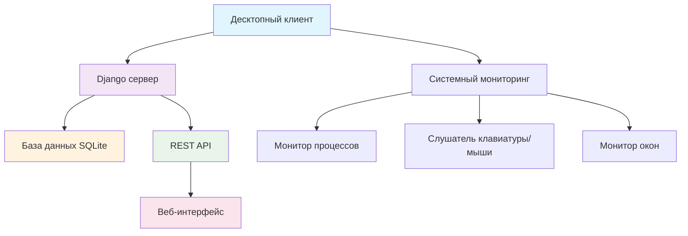
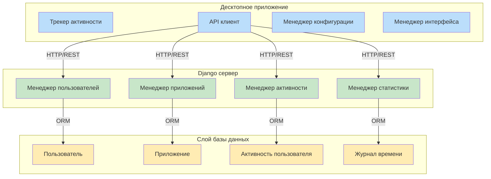
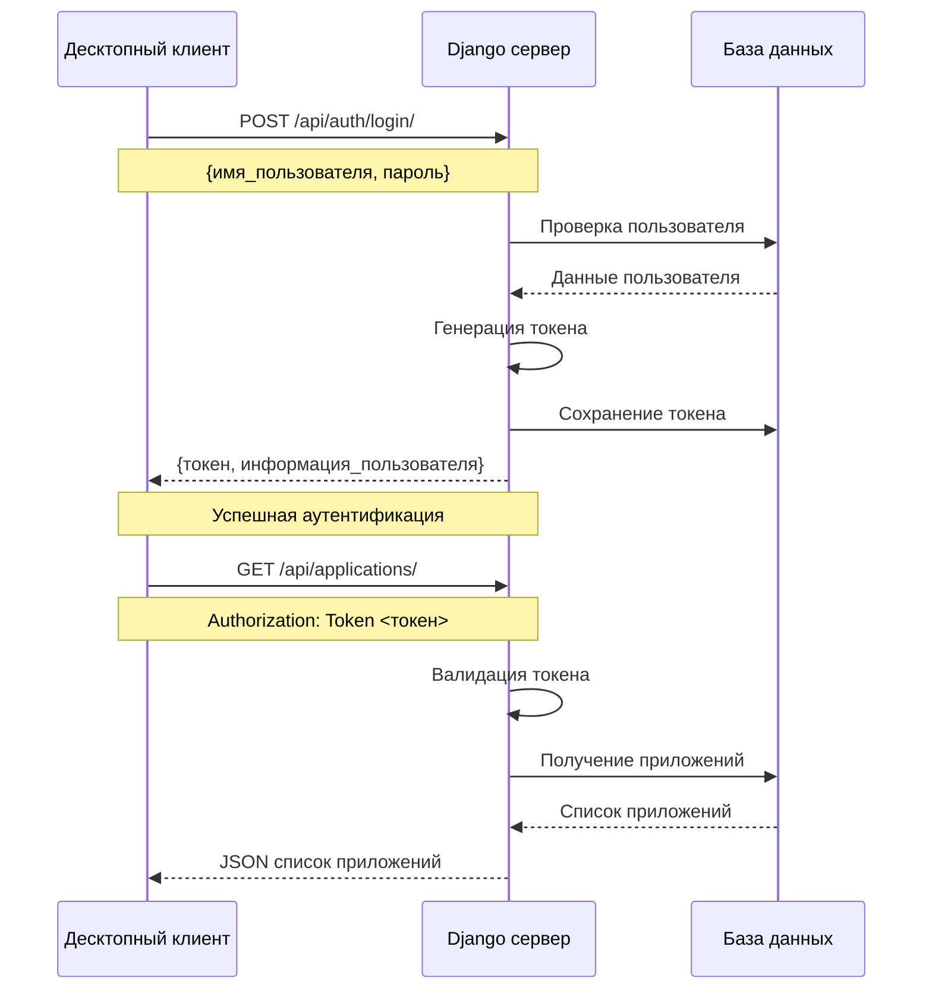
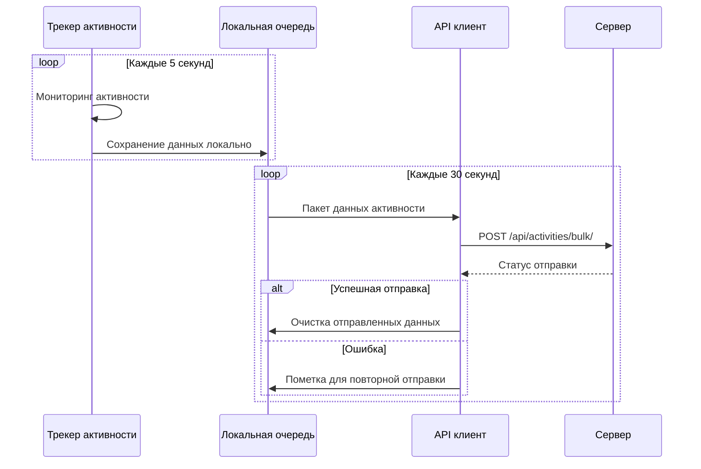
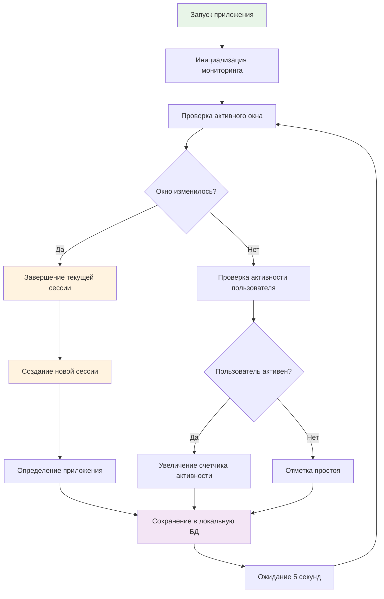
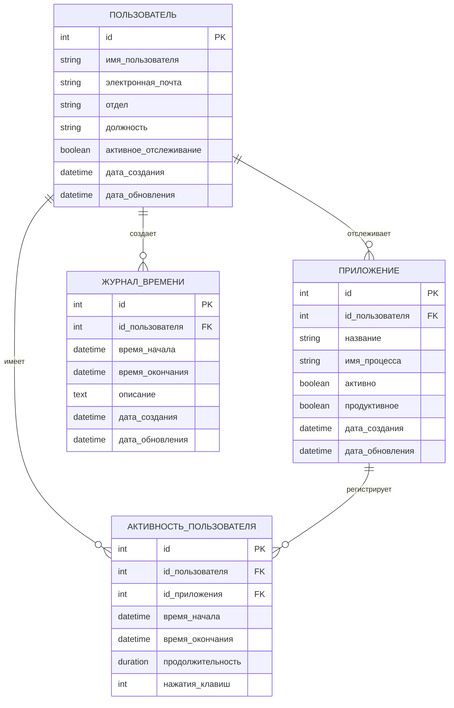
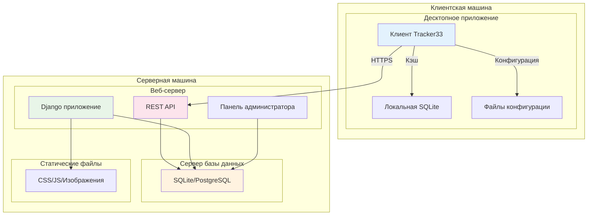
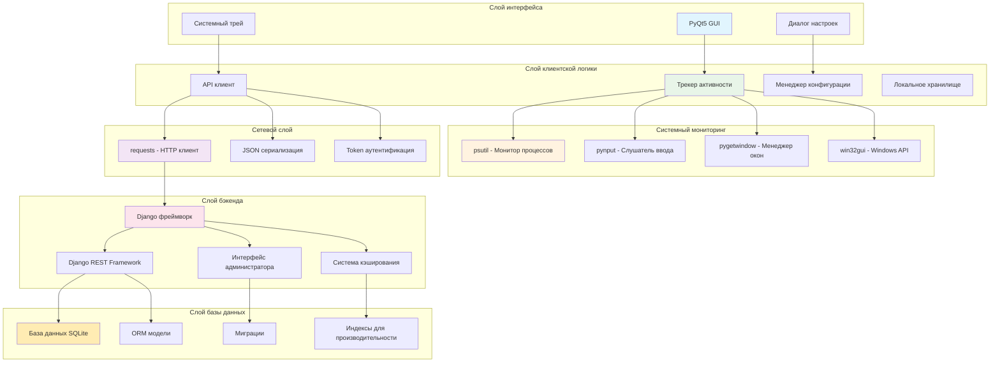

# ИЛЛЮСТРАЦИИ К ДИПЛОМНОЙ РАБОТЕ
## Система учета рабочего времени Tracker33

---

## Рисунок 1. Общая архитектура системы
**📍 Место в дипломе:** Раздел 1.3 "Проектирование информационной системы"



---

## Рисунок 2. Компонентная диаграмма системы
**📍 Место в дипломе:** Раздел 1.4.2 "Определения ключевых модулей системы"



---

## Рисунок 3. Диаграмма последовательности аутентификации
**📍 Место в дипломе:** Раздел 2.1.1 "Описание процесса разработки отдельных компонентов системы" (подраздел о серверной части)



---

## Рисунок 4. Схема отправки данных активности
**📍 Место в дипломе:** Раздел 2.1.1 "Описание процесса разработки отдельных компонентов системы" (подраздел о десктопном приложении)



---

## Рисунок 5. Алгоритм процесса отслеживания активности
**📍 Место в дипломе:** Раздел 2.1.1 "Описание процесса разработки отдельных компонентов системы" (после описания мониторинга активности)



---

## Рисунок 6. ER-диаграмма базы данных
**📍 Место в дипломе:** Приложение А "ER-диаграмма базы данных"



---

## Рисунок 7. Диаграмма развертывания системы
**📍 Место в дипломе:** Раздел 2.4.1 "Руководство пользователя для администраторов и сотрудников" (подраздел об установке)



---

## Рисунок 8. Диаграмма активности по времени (пример рабочего дня)
**📍 Место в дипломе:** Раздел 2.1.2 "Представление интерфейсов программы" (после описания веб-интерфейса статистики)

```mermaid
gantt
    title Пример рабочего дня пользователя
    dateFormat HH:mm
    axisFormat %H:%M
    
    section Продуктивные приложения
    Visual Studio Code    :done, code, 09:00, 11:30
    Chrome (разработка)   :done, chrome1, 11:30, 12:00
    Visual Studio Code    :done, code2, 13:00, 15:30
    Chrome (документация) :done, chrome2, 15:30, 16:00
    
    section Непродуктивные
    Обеденный перерыв     :crit, break1, 12:00, 13:00
    Социальные сети       :crit, social, 16:00, 16:30
    
    section Встречи
    Командная планерка    :active, meeting, 16:30, 17:30
```



---

## Рисунок 9. Схема API endpoints
**📍 Место в дипломе:** Приложение Б "Схема API endpoints"

```mermaid
graph LR
    subgraph "API аутентификации"
        A1[POST /api/auth/login/]
        A2[POST /api/auth/logout/]
        A3[GET /api/auth/user/]
    end
    
    subgraph "API приложений"
        B1[GET /api/applications/]
        B2[POST /api/applications/]
        B3[PUT /api/applications/{id}/]
        B4[GET /api/applications/discovered/]
    end
    
    subgraph "API активности"
        C1[GET /api/activities/]
        C2[POST /api/activities/]
        C3[POST /api/activities/bulk/]
        C4[GET /api/activities/current/]
    end
    
    subgraph "API статистики"
        D1[GET /api/statistics/dashboard/]
        D2[GET /api/statistics/summary/]
        D3[GET /api/statistics/productivity/]
    end
    
    style A1 fill:#ffcdd2
    style A2 fill:#ffcdd2
    style A3 fill:#ffcdd2
    style B1 fill:#c8e6c9
    style B2 fill:#c8e6c9
    style B3 fill:#c8e6c9
    style B4 fill:#c8e6c9
    style C1 fill:#bbdefb
    style C2 fill:#bbdefb
    style C3 fill:#bbdefb
    style C4 fill:#bbdefb
    style D1 fill:#fff9c4
    style D2 fill:#fff9c4
    style D3 fill:#fff9c4
```

---

## Рисунок 10. Архитектура технологического стека
**📍 Место в дипломе:** Раздел 1.2.2 "Описание выбранного стека технологий"



---

## 📋 КАРТА РАЗМЕЩЕНИЯ ДИАГРАММ В ДИПЛОМЕ

### Часть 1 - Теоретическая часть:
- **Рисунок 10** → 1.2.2 "Описание выбранного стека технологий"
- **Рисунок 1** → 1.3 "Проектирование информационной системы"  
- **Рисунок 2** → 1.4.2 "Определения ключевых модулей системы"

### Часть 2 - Практическая часть:
- **Рисунок 3** → 2.1.1 "Разработка серверной части"
- **Рисунок 4** → 2.1.1 "Десктопное приложение"
- **Рисунок 5** → 2.1.1 "После описания мониторинга активности"
- **Рисунок 8** → 2.1.2 "Веб-интерфейс статистики"
- **Рисунок 7** → 2.4.1 "Установка системы"

### Приложения:
- **Рисунок 6** → Приложение А "ER-диаграмма базы данных"
- **Рисунок 9** → Приложение Б "Схема API endpoints"

---

## 🎨 Особенности локализации:

**Переведены на русский язык:**
- Все названия компонентов системы
- Названия методов API и endpoints
- Подписи к элементам диаграмм
- Названия таблиц и полей в ER-диаграмме
- Временные метки и активности в Gantt-диаграмме

**Сохранены на английском:**
- Технические термины (REST, API, HTTP, JSON)
- Названия технологий (Django, PyQt5, SQLite)
- Названия библиотек (psutil, pynput, requests, win32gui)

**Исправлена архитектура:**
- PyQt5 вместо PyQt6 (соответствует реальному проекту)
- Добавлены Windows API модули (win32gui, win32process)
- Система кэширования Django
- Индексы для производительности базы данных
- Автоматическая синхронизация клиента с сервером

**Цветовая схема:**
- 🔵 Синий (#e1f5fe, #bbdefb) - Клиентские компоненты
- 🟢 Зеленый (#e8f5e8, #c8e6c9) - Серверные компоненты  
- 🟡 Желтый (#fff3e0, #ffecb3) - База данных
- 🟣 Фиолетовый (#f3e5f5) - API и сетевые компоненты
- 🔴 Красный (#ffcdd2, #fce4ec) - Веб-интерфейс и аутентификация